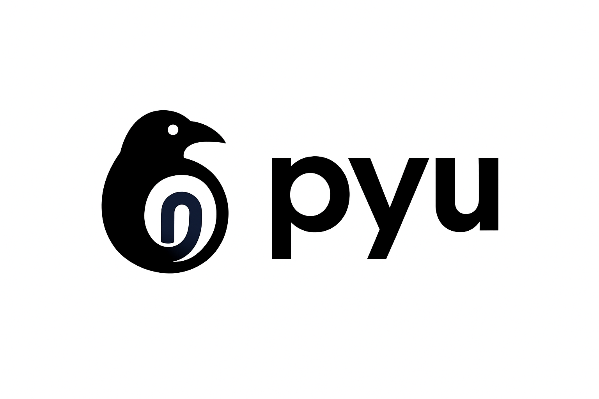

# PyU - Python Utilities

<div align="center">
  
</div>

<div align="center">
  <strong>A comprehensive collection of Python utilities for developers</strong>
</div>

<br>

The `raven-pyu` is a versatile Python utility library designed to enhance your development workflow with powerful tools for performance analysis, profiling, and code optimization. Built by Happy Raven Labs, PyU provides elegant, easy-to-use solutions for common development challenges.

## ✨ Features

- **🔍 Performance Profiling**: Comprehensive time and memory profiling tools


## 📦 Installation

```bash
pip install raven-pyu
```

## 🧩 Modules

### Profiling Module

The profiling module provides powerful tools for measuring and analyzing the performance of your Python code.

**Key Features:**
- Time profiling with microsecond precision
- Memory usage tracking and analysis  
- Line-by-line performance breakdowns
- Multiple output formats (console, CSV, text)
- Statistical analysis with rich reporting

📖 **[Full Profiling Documentation →](pyu/profiling/README.md)**

## 🔧 Requirements

- Python 3.8 or higher
- Rich (for beautiful console output)

## 📝 License

This project is licensed under the MIT License - see the [LICENSE](LICENSE) file for details.

## 📑 Cite Us

```bibtex
@misc{HappyRavenLabs_pyu,
  author       = {HappyRavenLabs},
  title        = {pyu: Utility tools for Python},
  howpublished = {\url{https://github.com/HappyRavenLabs/pyu}},
  year         = {2025},
  note         = {Version v1.0.2 (accessed: 2025-10-28)}
}
```

```
HappyRavenLabs. (2025). pyu: Utility tools for Python (Version v1.0.2) [Software]. Retrieved from https://github.com/HappyRavenLabs/pyu
```

## 🏢 About

Developed with ❤️ by **Happy Raven Labs**

---
